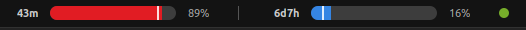
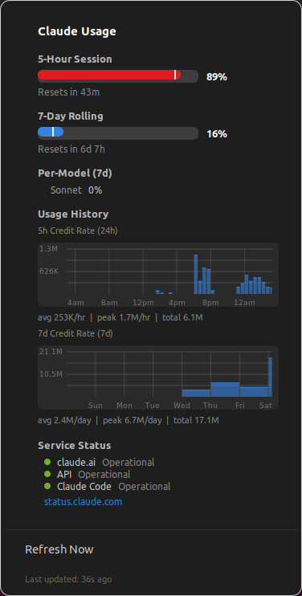

# Claude Usage — GNOME Shell Extension

A GNOME Shell 42 extension that displays your Claude AI usage in the Ubuntu top bar.

Top bar with 5h/7d usage bars, countdowns, and status dot:



Click to open the dropdown with usage details, credit history graphs, and service status:



## What it shows

- **5-hour session** and **7-day rolling** usage as progress bars with percentages
- Live countdown timers showing time until each window resets
- Time-position markers on each bar showing how far through the current window you are
- Color coding: blue (<50%), amber (50–80%), red (>80%)
- Click to expand a dropdown with detailed countdowns, per-model breakdown, and a refresh button
- **Usage history graphs** — two bar charts showing instantaneous credit consumption over time, loaded when the dropdown opens:
  - **5h Credit Rate (24h)**: 30-minute bars aligned to clock half-hours, with tick marks at 4-hour intervals (12am, 4am, 8am, etc.)
  - **7d Credit Rate (7d)**: daily bars aligned to midnights, with tick marks at each day of the week
  - Credit values computed from utilization percentages and known per-tier credit limits
  - Partial buckets (current period) are rate-scaled and shown at proportional width
  - Summary stats: avg/period, peak/period, and total credits consumed
  - Downsampling uses LTTB (Largest Triangle Three Buckets) when needed
- **Service status dot** — colored indicator showing the current status of Claude services (polls [status.claude.com](https://status.claude.com) every 2 minutes)
- Dropdown shows per-component status (claude.ai, API, Claude Code) and active incidents with a link to the status page

## Requirements

- GNOME Shell 42 (Ubuntu 22.04)
- A Claude Pro/Max subscription with Claude Code installed
- OAuth credentials at `~/.claude/.credentials.json` (created automatically by Claude Code)

## Install

```bash
git clone https://github.com/gustavomoura628/claude-usage-gnome-extension.git
cd claude-usage-gnome-extension
./install.sh
```

Log out and back in for the extension to load.

## Usage logging

The extension logs usage data every 5 minutes to `~/.local/share/claude-usage/history.jsonl`. Each line is a JSON object:

```json
{"ts":"2026-02-04T03:59:24.336Z","plan":"max","tier":"default_claude_max_5x","5h":10,"5h_resets":"2026-02-04T08:00:00Z","7d":26,"7d_resets":"2026-02-06T14:00:00Z","sonnet_7d":0}
```

Fields: timestamp, subscription plan, rate limit tier, 5-hour and 7-day utilization percentages, window reset times, and per-model breakdowns (when available). Window start times can be derived from the reset times (subtract 5h or 7d).

## How it works

The extension reads your OAuth token from `~/.claude/.credentials.json` and polls `https://api.anthropic.com/api/oauth/usage` every 45 seconds. Service status is fetched from `https://status.claude.com/api/v2/summary.json` every 2 minutes (no auth needed). No browser cookies needed.

## Files

| File | Purpose |
|------|---------|
| `metadata.json` | Extension manifest |
| `extension.js` | Lifecycle: `init()`, `enable()`, `disable()` |
| `indicator.js` | Panel widget + dropdown menu + Cairo-drawn progress bars and history graphs |
| `apiClient.js` | Async HTTP client (Soup 2.4) |
| `credentialReader.js` | Reads OAuth token and plan info from disk |
| `usageLogger.js` | Appends usage snapshots to JSONL log file |
| `historyReader.js` | Reads JSONL history, computes credit deltas, clock-aligned bucketing, LTTB downsampling |
| `stylesheet.css` | Dropdown and label styling |

## Uninstall

```bash
gnome-extensions disable claude-usage@local
rm -rf ~/.local/share/gnome-shell/extensions/claude-usage@local
```
