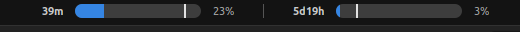

# Claude Usage — GNOME Shell Extension

A GNOME Shell 42 extension that displays your Claude AI usage in the Ubuntu top bar.



## What it shows

- **5-hour session** usage with progress bar, percentage, and time-position marker
- **7-day rolling** usage with progress bar, percentage, and time-position marker
- Color coding: blue (<50%), amber (50–80%), red (>80%)
- Click to expand a dropdown with countdowns, per-model breakdown, and a refresh button

## Requirements

- GNOME Shell 42 (Ubuntu 22.04)
- A Claude Pro/Max subscription with Claude Code installed
- OAuth credentials at `~/.claude/.credentials.json` (created automatically by Claude Code)

## Install

```bash
./install.sh
gnome-extensions enable claude-usage@local
```

Then restart GNOME Shell:
- **X11:** Alt+F2 → `r` → Enter
- **Wayland:** Log out and back in

## How it works

The extension reads your OAuth token from `~/.claude/.credentials.json` and polls `https://api.anthropic.com/api/oauth/usage` every 45 seconds. No browser cookies needed.

## Files

| File | Purpose |
|------|---------|
| `metadata.json` | Extension manifest |
| `extension.js` | Lifecycle: `init()`, `enable()`, `disable()` |
| `indicator.js` | Panel widget + dropdown menu + Cairo-drawn progress bars |
| `apiClient.js` | Async HTTP client (Soup 2.4) |
| `credentialReader.js` | Reads OAuth token from disk |
| `stylesheet.css` | Dropdown and label styling |

## Uninstall

```bash
gnome-extensions disable claude-usage@local
rm -rf ~/.local/share/gnome-shell/extensions/claude-usage@local
```
